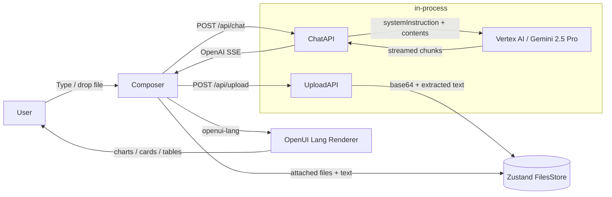

# HyperAnalyse

> Generative UI workspace powered by **OpenUI Lang** + **Google Vertex AI (Gemini)**.

HyperAnalyse is an AI agent assistant that responds with rich UI — charts, dashboards, tables, sections, follow-ups — instead of endless paragraphs of text. Drop a PDF, DOCX, XLSX, CSV, image, or text file into the chat and HyperAnalyse will analyse it, ground its response in the document, and surface the answer as a structured visual artifact.

This package is **Phase 1 of 3**:

| Phase | Scope | Status |
| --- | --- | --- |
| **1** | Foundation: chat with OpenUI Lang rendering, multimodal file upload, Vertex AI streaming | ✅ this PR |
| 2 | Slides artifact (`<Slides>` component, deck export, tool calling) | next |
| 3 | Long-form report artifact (PDF export, multi-section reports) | after that |

## Architecture



- **Frontend** — Next.js 16 App Router, React 19, Tailwind 4, OpenUI Lang.
- **Composer** — `<HyperAnalyseComposer>` wraps the OpenUI shell input with paperclip + drag-and-drop; uploads go to `/api/upload` and arrive back as binary parts on the next message.
- **Sidebar** — `<FilePanel>` lists every uploaded file. Each chip can be detached/re-attached to control which files ship with the next message.
- **`/api/upload`** — accepts `multipart/form-data`, validates mimeType + ≤20 MB, extracts text from DOCX (mammoth) / XLSX (sheetjs) so Gemini sees clean text instead of binary blobs Gemini can't ingest. PDFs and images stay binary and ride as `inlineData`.
- **`/api/chat`** — converts AG-UI / OpenAI messages → Vertex `Content[]`, prepends a system instruction (HyperAnalyse rules + the CLI-generated component reference), streams the response back as OpenAI-format SSE consumable by `openAIAdapter()`.
- **`<library.ts>`** — extends `openuiChatLibrary` with HyperAnalyse-specific rules (charts > prose, always-on FollowUpBlock, file-aware citations).

## File layout

```
hyperanalyse/
├─ src/
│  ├─ app/
│  │  ├─ api/
│  │  │  ├─ chat/route.ts           # Vertex AI streaming chat
│  │  │  ├─ chat/conversionUtils.ts # OpenAI ↔ Vertex format + SSE
│  │  │  ├─ chat/systemPrompt.ts    # static system instructions
│  │  │  └─ upload/route.ts         # multipart file ingest + text extraction
│  │  ├─ globals.css
│  │  ├─ layout.tsx
│  │  └─ page.tsx                   # FullScreen + FilePanelMount
│  ├─ components/
│  │  ├─ FilePanel.tsx              # sidebar list of uploaded files
│  │  ├─ FilePanelMount.tsx         # portals FilePanel into the OpenUI sidebar
│  │  ├─ HyperAnalyseComposer.tsx   # composer with file upload + drag-drop
│  │  └─ HyperAnalyseWelcome.tsx
│  ├─ hooks/use-system-theme.tsx
│  ├─ lib/
│  │  ├─ extract-text.ts            # mammoth / xlsx text extraction
│  │  ├─ files-store.ts             # Zustand store (in-memory)
│  │  ├─ mime.ts                    # mime classification + extension map
│  │  └─ vertex-client.ts           # Vertex AI singleton (BYOK)
│  ├─ library.ts                    # OpenUI Lang library + prompt rules
│  └─ generated/system-prompt.txt   # produced by `pnpm generate:prompt`
├─ public/logo.svg
├─ next.config.ts
├─ tsconfig.json
├─ eslint.config.mjs
├─ postcss.config.mjs
├─ package.json
├─ .env.example
└─ README.md  ← you are here
```

## Setup

### 1. Install

```bash
pnpm install
```

HyperAnalyse is a standalone Next.js app — `@openuidev/react-headless`, `@openuidev/react-lang`, `@openuidev/react-ui`, and `@openuidev/cli` are pulled from npm. There is no openui monorepo dependency.

### 2. Create a Vertex AI service account

HyperAnalyse uses **bring-your-own-key (BYOK)** auth via a Google Cloud service account. There's no global key — each user supplies their own credentials.

1. Open the [Google Cloud Console](https://console.cloud.google.com/) and select (or create) a project.
2. Enable the **Vertex AI API** for that project: **APIs & Services → Library → Vertex AI API → Enable**.
3. Create a service account: **IAM & Admin → Service Accounts → Create Service Account**.
   - Name: `hyperanalyse-vertex` (anything works).
   - Grant the role **Vertex AI User** (`roles/aiplatform.user`).
4. Open the new service account → **Keys → Add Key → Create new key → JSON**. Save the file as `service-account.json` in the repo root. The `.gitignore` excludes `service-account.json`, `service-account*.json`, `.env`, `.env.local`, and `.env.*.local` so secrets stay local.
5. Pick a region from the [Vertex AI region list](https://cloud.google.com/vertex-ai/generative-ai/docs/learn/locations) — `us-central1` and `europe-west4` are good defaults.

### 3. Configure environment variables

```bash
cp .env.example .env.local
```

`.env.local`:

```bash
GOOGLE_APPLICATION_CREDENTIALS=./service-account.json
GCP_PROJECT_ID=your-project-id
GCP_LOCATION=us-central1
VERTEX_MODEL=gemini-2.5-pro
```

For serverless deploys where filesystem access is awkward, base64-encode the JSON instead:

```bash
GOOGLE_SERVICE_ACCOUNT_JSON_BASE64=$(base64 -w0 service-account.json)
```

### 4. Run

```bash
pnpm --filter hyperanalyse dev
```

The `dev` script first runs `pnpm generate:prompt`, which compiles the OpenUI CLI and writes `src/generated/system-prompt.txt` from `src/library.ts`. Visit [http://localhost:3000](http://localhost:3000).

## File upload usage

- Click the paperclip in the composer **or** drop files anywhere on the chat — both routes hit `/api/upload`.
- Accepted types: `.pdf, .docx, .xlsx, .xls, .csv, .txt, .md, .json, .png, .jpg, .jpeg, .gif, .webp`.
- Maximum 20 MB per file (Vertex AI inline limit).
- Each file appears as a chip above the textarea + a row in the **Files** sidebar. Click a row to toggle "in context"; click `×` on a chip to detach.
- Attached files travel with the **next** message:
  - **Inline-supported** (PDF, images): sent as `inlineData` parts to Gemini.
  - **Extracted-text** (DOCX, XLSX, CSV, TXT, MD, JSON): server-side extracted to UTF-8 text before send-time, so Gemini ingests clean text instead of binary blobs it cannot parse.

After a message ships, files stay in the sidebar but are detached. Re-click them to ground the next answer in the same documents.

## Try it

Two prompts that should produce noticeably different outputs:

1. **Pure chart prompt** (no upload):
   > "Compare AWS, Azure, and GCP market share over the past four quarters with a stacked bar chart and a follow-up that drills into AWS regions."

2. **File-grounded prompt**:
   > _Drop a CSV with sales rows, then ask:_ "Build me a sales dashboard with KPIs, regional split, and a 3-month trend. Cite the file by name."

In both cases HyperAnalyse should return a `Card` with `CardHeader`, structured `BarChart`/`LineChart`/`Table` blocks, optional `SectionBlock`, and a closing `FollowUpBlock`.

## Roadmap

| Phase | What's added |
| --- | --- |
| **2 — Slides artifact** | `<Slides>` artifact component, deck preview pane, PPTX export, Gemini tool calls (`generate_slides`, `update_slide`). |
| **3 — Report artifact** | Long-form `<Report>` artifact rendered in the artifact panel with section navigation + branded PDF export. |

Both phases reuse the same Vertex AI client, the same OpenUI Lang library, and the same `<FullScreen>` shell — they just register additional artifact components and tool definitions.

## Non-goals (Phase 1)

- ❌ Slides / report artifacts (Phase 2 / 3).
- ❌ Tool calling (Phase 2 introduces `generate_slides` etc.).
- ❌ Thread persistence — each visit is one ephemeral conversation in memory.
- ❌ Authentication — user supplies their own Vertex credentials.
- ❌ Production deployment config — focus is local-first.

## Troubleshooting

- **`Missing Vertex AI credentials`** — ensure either `GOOGLE_APPLICATION_CREDENTIALS` points to a readable JSON file or `GOOGLE_SERVICE_ACCOUNT_JSON_BASE64` decodes to valid JSON.
- **`Vertex AI request failed: 403`** — the service account is missing the `Vertex AI User` role, or the API is not enabled in that project.
- **`400 Unsupported MIME type`** when uploading a DOCX/XLSX — text extraction failed; check the server log. Gemini does **not** accept DOCX/XLSX as `inlineData` directly, which is why HyperAnalyse extracts text server-side.
- **Empty response** — open the network tab and check `/api/chat`'s SSE stream. The first frame should be `data: {"choices":[{"delta":{"role":"assistant","content":""}}]}`.

---

Built on top of [OpenUI](https://openui.com) — generative UI for AI assistants.
